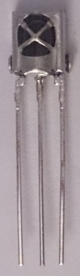
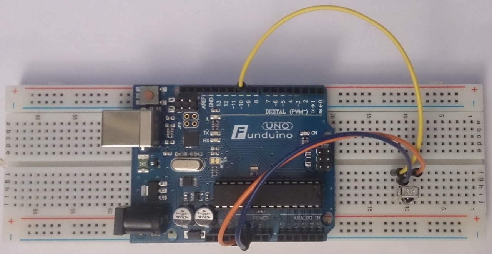
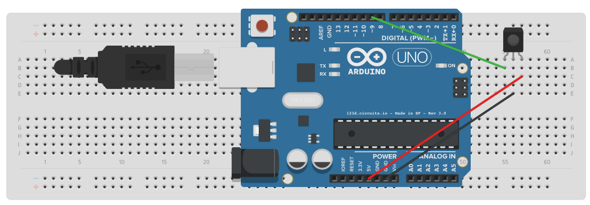

# IR Code mit Arduino Auslesen

Bei diesem Versuch verwende ich einen IR Empfänger und die Bibliothek 
IRremote.

Somit kann bei einer Fernbedienung vom Fernseher die Codes der Tasten 
Auslesen, und bei einem anderem Projekt hinterlegen.

Damit ist es möglich z.B.: mit der Fernbedienung neben dem Fernseher auch 
eine Relaiskarte zu schalten.

Oder für später falls die Fernbedienung defekt ist, es zum Programmieren 
einer ersatz Fernbedienung.

## Verdrahtung



Der Linke Pin kommt auf dem Arduino auf den Eingang *9*.

Mittlere Pin ist *GND* und der Rechte *+*.

Nach dem Aufbau sieht es so wie auf dem Bild aus.





## Sketch (Code)

Kurze Beschreibung vom Sketch für Arduino

* Bibliothek IRremote einbinden, somit kann der Sensor einfacher verwendet werden.
```
#include <IRremote.h>
```     

* IR Empfänger auf Pin 9
* Status LED auf Pin 13 verwenden (auf dem Aduino UNO ist Pin 13 auch 
mit der LED auf dem Board verbunden)
```
int RECV_PIN = 9;
int STATLED = 13;
```


```Arduino
void setup()
{
  Serial.begin(9600);
  pinMode(STATLED, OUTPUT); // set STATLED as Output
  irrecv.enableIRIn(); // Start the receiver
  digitalWrite(STATLED, LOW);
}

void loop() {
  if (irrecv.decode(&results)) {
    digitalWrite(STATLED, HIGH);
    Serial.print("Hex - ");
    Serial.print(results.value, HEX); // print results as HEX
    Serial.print(" - Dec - ");
    Serial.print(results.value); // print results as decimal
    Serial.println("");
    irrecv.resume(); // Receive the next value
    digitalWrite(STATLED, LOW);
  }
}
```

### Der ganze Sketch (Code)

```Arduino
/*
IR Code Auslesen

*/
#include <IRremote.h>

int RECV_PIN = 9;
int STATLED = 13;

IRrecv irrecv(RECV_PIN);

decode_results results;

void setup()
{
  Serial.begin(9600);
  pinMode(STATLED, OUTPUT);
  irrecv.enableIRIn(); // Start the receiver
  digitalWrite(STATLED, LOW);
}

void loop() {
  if (irrecv.decode(&results)) {
    digitalWrite(STATLED, HIGH);
    Serial.print("Hex - ");
    Serial.print(results.value, HEX); // print results as HEX
    Serial.print(" - Dec - ");
    Serial.print(results.value); // print results as decimal
    Serial.println("");
    irrecv.resume(); // Receive the next value
    digitalWrite(STATLED, LOW);
  }
}
```
## Arduino Fernbedinung

Mit der Arduino Fernbedienung bekommt man folgende Codes beim Auslesen.

```
AUS - FFA25D
Mode - FF629D
Mute - FFE21D
Play/Pause - FF22DD
Rew - FF02FD
Fwd - FFC23D
EQ - FFE01F
Leise - FFA857
Lauter - FF906F
Num 0 - FF6897
Random - FF9867
U/SD - FFB04F
Num 1 - FF30CF
Num 2 - FF18E7
Num 3 - FF7A85
Num 4 - FF10EF
Num 5 - FF38C7
Num 6 - FF5AA5
Num 7 - FF42BD
Num 8 - FF4AB5
Num 9 - FF52AD
```

Wenn der Code *FFFFFF* Angezeigt wird, bedeutet dies Repeat und entsteht falls die Taste auf der
Fernbedienung länger gedrückt wird.

## Quellen

* [Arduino-info IR-RemoteControl](https://arduino-info.wikispaces.com/IR-RemoteControl)
* [IRremote Bibliothek](https://github.com/z3t0/Arduino-IRremote)
