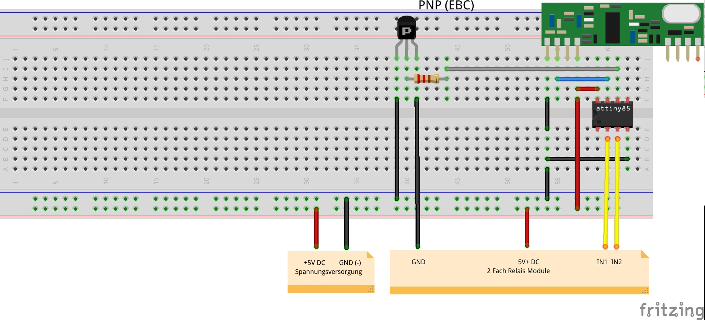
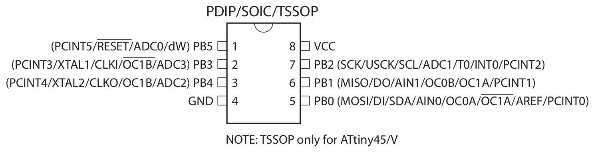

# RF AtTiny85 gesteuerter Lastenaufzug

**Anleitung in Arbeit**

Da wir gerne Grillen aber die Sachen vom 1.OG jedesmal hinunter und 
wieder rauftragen müssen, haben wir uns entschlossen 
eine Seilwinde die noch in der Garage lag unter dem Balkon im 2.OG zu 
montieren.

Die Montage war einfach, aber leider stellte sich heraus das die 
Seilwinde sehr Langsam ist, und man die nur mit einem 2m Kabel vom 1.OG 
bedienen konnte.

Also habe ich mir überlegt dies per Microcontroller über Funk zu 
Steuern.

Da der Microcontroller keine hohe Lasten schalten kann, Steuere ich 
damit 2 Wechselrelais an.
Die Relais werden auf der 230VAC Seite so verdrahtet, dass auch bei 
einem Stecken von einem Relais immer nur eines aktiv sein kann.
Ob das jetzt das Relais für Rauf oder Runter ist kommt von der 
Sicherheit darauf an (bei mir ist es Rauf da sonst der Motor keinen
Abschaltpunkt hat).

**Tipp:**
Wenn man mehr Geld Investieren möchte, wäre ein Sicherheitsrelais 
(Schütz) dafür besser vorgesehen. Da es aber Privat ist und der 
Lastenaufzug gerade mal ca. 10x im Jahr genutzt wird, ist das nicht so 
schlimm. (über Winter wird es vom Netz getrennt).

Damit auch der Lastenaufzug vor Ort Manuell bedient werden kann, sind 
auch noch 2 Taster (Rauf, Runter) am Kasten montiert.

Da es sehr viel mit 433Mhz Fernbedinung gibt, habe ich zuerst den Code 
von der FB Ausgelesen und es in die Konditionen im Loop eingebaut.
Zum Empfangen hat sich die Lib RC-Switch am besten bewährt.

Da die Relais eher Träge sind, wird zur Sicherheit zwischen dem 
Umschalten 80ms gewartet.
Es würde zwar durch die Verdrahtung nichts machen wenn beide Relais 
aktiv sind, aber man muss es ja nicht fordern.


## Benötigte Teile

* 1x 433Mhz Empfänger (E-Bay um ca. 2,50 € (Sender & Empfänger)
* 1x AtTiny85 (für die Steuerung)
* 1x Transistor PNP
* 1x 2-Fach Relais (Bei E-Bay um ca. 5 €) *Achtung: ich habe aus 
versehen die Relais mit Optokopler gekauft, somit muss ich zum 
Abschalten der Relais die Ports auf HIGH setzen.*


## Verdrahtung

Die Verdrahtung ist dank dem AtTiny85 sehr einfach.



**Die Pins vom AtTiny85 werden wie dargestellt verwendet:**

*PB1* -> aktivierung Spannungsversorgung vom Relais über PNP Transistor
*PB2* -> *DATA* RF-Empfänger
*PB3* -> *IN1* Relais 1
*PB4* -> *IN2* Relais 2
*VIN* -> max. 5,5 VDC
*GND* -> GND

## Erklärung Code


```Arduino


## AtTinyX5 Pins und Datenblatt

Eine kurze Darstellung der Pins vom AtTinyX5 Serie



Das Offizielle Datenblatt von Atmel

[PDF Datasheet AtTiny25 - 85](Doku/Atmel-2586-AVR-8-bit-Microcontroller-ATtiny25-ATtiny45-ATtiny85_Datasheet.pdf)

## Quellen

* [RC-Switch](https://github.com/sui77/rc-switch)
* [Atmel AtTiny85](http://www.atmel.com/devices/attiny85.aspx)
