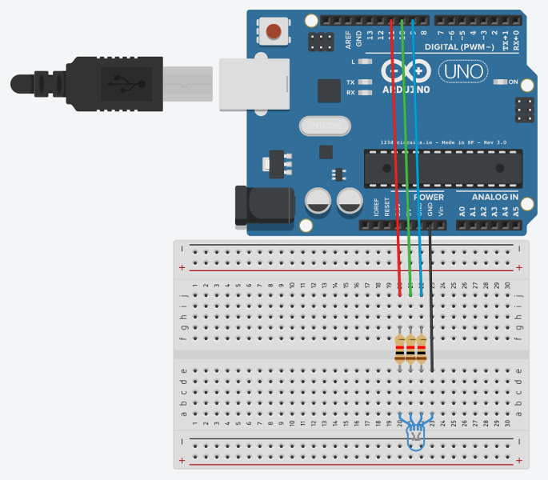
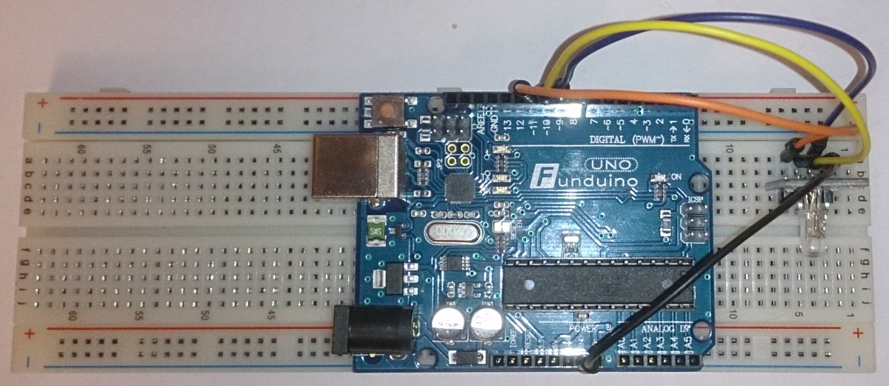

# RGB LED

Bei diesem Experiment Steuern wir die RGB LED am Arduino Uno.

## Verdrahtung

Wie am Schaltplan dargestellt, Verbinden wir die Pins mit dem Arduino Uno
auf die Pins 9,10,11 mit einem Wiederstand von 1000 Ohm.
Die GND verbinden wir direkt mit dem Arduino.



Fertig sieht es wie auf dem Foto aus.



* Video zu dieser Schaltung

[](https://youtu.be/ROpkROSD6RU)


## Sketch (Code)

* Globale Pin einstellungen und falls die RGB LED *COMMON_ANODE* verwendet,
kann man diese Auskommentieren.

```Arduino
int redPin = 11;
int bluePin = 9;
int greenPin = 10;
int FADESPEED = 5;
// uncomment if your RGB LEDs works with Common Anode
//#define COMMON_ANODE

```

In diesem Sketch werden 2 Funktionen dargestellt.

* Funktion **fadeRGB**:

Hier lassen wir die RGB LED alle Farben einmal durchlaufen.
Dabei ist der Wert *255* 100% Lichtstärke und *0* LED Aus.
Somit können die LEDs die Farben mischen.

```Arduino
void fadeRGB()
{
  int r, g, b;
 
  // fade from blue to violet
  for (r = 0; r < 256; r++) { 
    analogWrite(redPin, r);
    delay(FADESPEED);
  } 
  // fade from violet to red
  for (b = 255; b > 0; b--) { 
    analogWrite(bluePin, b);
    delay(FADESPEED);
  } 
  // fade from red to yellow
  for (g = 0; g < 256; g++) { 
    analogWrite(greenPin, g);
    delay(FADESPEED);
  } 
  // fade from yellow to green
  for (r = 255; r > 0; r--) { 
    analogWrite(redPin, r);
    delay(FADESPEED);
  } 
  // fade from green to teal
  for (b = 0; b < 256; b++) { 
    analogWrite(bluePin, b);
    delay(FADESPEED);
  } 
  // fade from teal to blue
  for (g = 255; g > 0; g--) { 
    analogWrite(greenPin, g);
    delay(FADESPEED);
  }
}

```

* Funktion setColor()

Mit dieser Funktion kann man unter einmal jede Farbe einstellen.
Oder wenn man *setColor(0,0,0)* übergibt, schaltet die LED aus.
 
```Arduino
void setColor(int red, int green, int blue)
{
  /*
  red = 255 - red;
  green = 255 - green;
  blue = 255 - blue;
  */
  analogWrite(redPin, red);
  analogWrite(greenPin, green);
  analogWrite(bluePin, blue);
}

```

* Kompletter Sketch

```Arduino
/*
  RGB LED Steuerung
*/

int redPin = 11;
int bluePin = 9;
int greenPin = 10;
int FADESPEED = 5; // fade color speed
// uncomment if your RGB LEDs works with Common Anode
//#define COMMON_ANODE

void setup() 
{
  Serial.begin(9600);
  pinMode(redPin, OUTPUT);
  pinMode(bluePin, OUTPUT);
  pinMode(greenPin, OUTPUT);
}

void loop()
{
  fadeRGB();
  delay(1000);
  // RED
  setColor(255,0,0);
  delay(2000);
  // Green
  setColor(0,255,0);
  delay(2000);
  // Blue
  setColor(0,0,255);
  delay(2000);
  setColor(0,0,0);
  delay(10000); // Pause 10 Sec and restart program
}

// smooth fade RGB LED
void fadeRGB()
{
  int r, g, b;
 
  // fade from blue to violet
  for (r = 0; r < 256; r++) { 
    analogWrite(redPin, r);
    delay(FADESPEED);
  } 
  // fade from violet to red
  for (b = 255; b > 0; b--) { 
    analogWrite(bluePin, b);
    delay(FADESPEED);
  } 
  // fade from red to yellow
  for (g = 0; g < 256; g++) { 
    analogWrite(greenPin, g);
    delay(FADESPEED);
  } 
  // fade from yellow to green
  for (r = 255; r > 0; r--) { 
    analogWrite(redPin, r);
    delay(FADESPEED);
  } 
  // fade from green to teal
  for (b = 0; b < 256; b++) { 
    analogWrite(bluePin, b);
    delay(FADESPEED);
  } 
  // fade from teal to blue
  for (g = 255; g > 0; g--) { 
    analogWrite(greenPin, g);
    delay(FADESPEED);
  }
}

void setColor(int red, int green, int blue)
{
  /*
  red = 255 - red;
  green = 255 - green;
  blue = 255 - blue;
  */
  analogWrite(redPin, red);
  analogWrite(greenPin, green);
  analogWrite(bluePin, blue);
}
```

