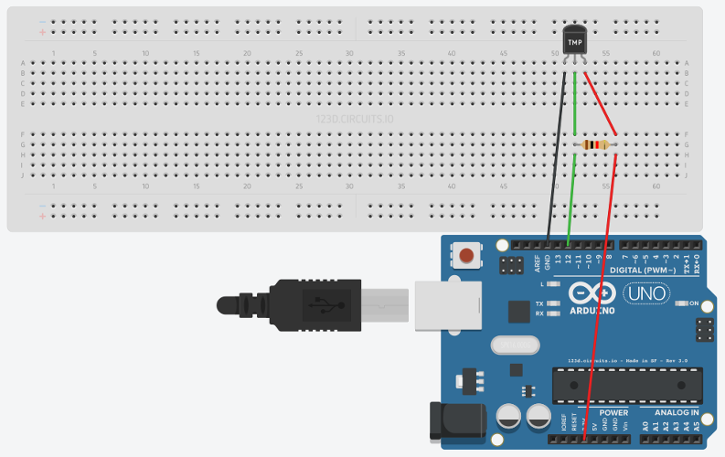
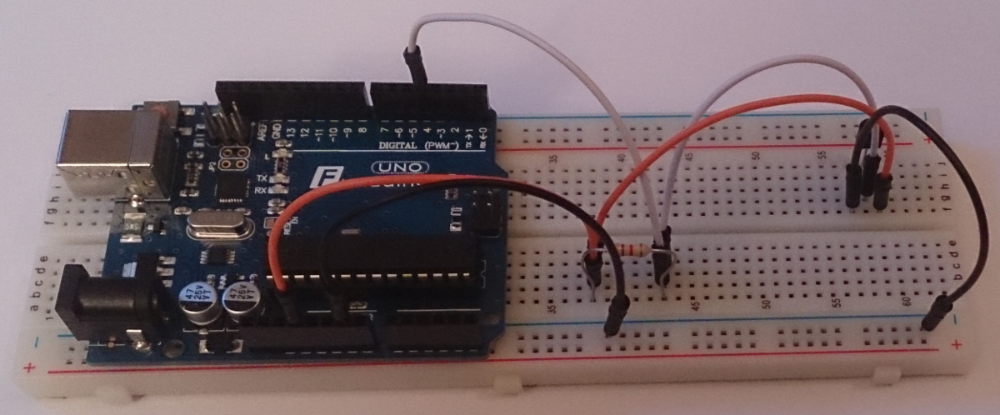
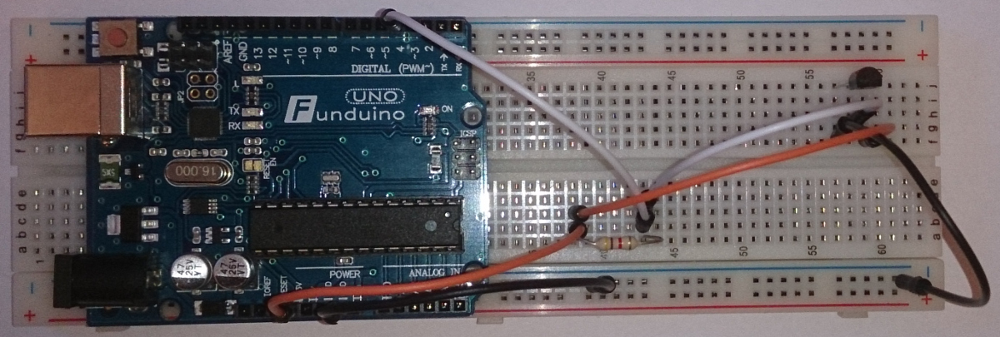
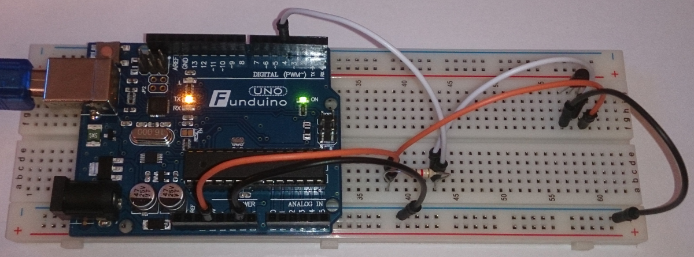

# Temperatur Sensoren mit ID Auslesen


## Schaltung

Wie in der Darstellung Abgebildet verbinden wir den Sensor mit unserem Arduino.

Und schalten einen Widerstand von 4,7kOhm zwischen 3.3V und dem Kommunikationspin.










* Schaltung in Aktion

[](https://youtu.be/lkTJRRQ38B0)

## Sketch (Code)

Dieser Code ist gut Kommentiert und somit muss man nicht mehr viel dazu Schreiben.

Es kann auch mit mehreren DS18B20 / DS18S20 verwendet werden.


```Arduino
/*
  Temperatur Sensoren DS18B20 bzw. DS18S20 mit SensorID Auslesen.
  Der Wert wird bereits in Grad Celsius umgerechnet.
  
*/

// Bibliotheken laden
#include <OneWire.h>
#include <DallasTemperature.h>

// Pin für DS18B20 definieren Arduino
#define DS18B20_PIN 4

// alle x Millisekunden messen
int mtime = 10000;
// LED anzeige auf folgendem Port (somit sieht man, wann
// die Messung erfolgt
int ledport = 13;

// OneWire Referenz setzen
OneWire oneWire(DS18B20_PIN);

// DS18B20/DS18S20 initialisieren
DallasTemperature sensors(&oneWire);
DeviceAddress tempDeviceAddress;
void setup() {
  // Serielle Ausgabe starten 
  Serial.begin(9600);
  // DS18B20/DS18S20 starten
  sensors.begin();
  pinMode(ledport, OUTPUT);
}

void loop() {
  // Starten der Messung LED einschalten
  digitalWrite(ledport, HIGH);
  // Temperatursensor auslesen
  sensors.requestTemperatures();
  for(byte i=0;i<sensors.getDeviceCount();i++){
    sensors.getAddress(tempDeviceAddress, i);
    // funktion Aufrufen und UUID inkl. Temperatur ueber die 
    // Serielle Schnittstelle ausgeben.
    serialout_temperature(getuuid(tempDeviceAddress),sensors.getTempCByIndex(i));  
  }
  // LED am Ende wieder abschalten
  digitalWrite(ledport,LOW);
  delay(mtime);
}

// Temperatur ausgeben
void serialout_temperature(byte devaddr,float temp) {
  Serial.print(devaddr);
  Serial.print(";");
  Serial.print(temp);
  Serial.print(";");
  Serial.print("\n");
}

// Sensoruuid Ausgeben
int getuuid(DeviceAddress deviceAddress)
{
  for (uint8_t i = 0; i < 8; i++)
  {
    if (deviceAddress[i] < 16) Serial.print("0");
    Serial.print(deviceAddress[i], HEX);
  }
}
```
